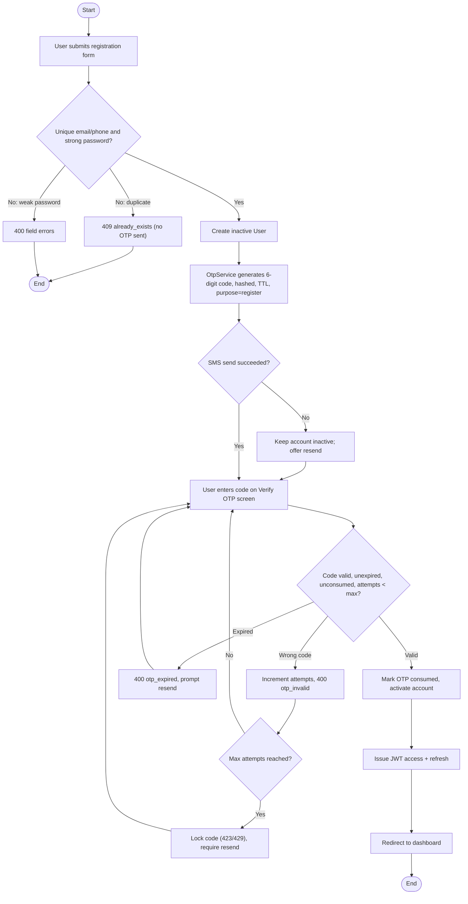
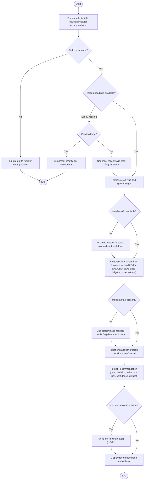
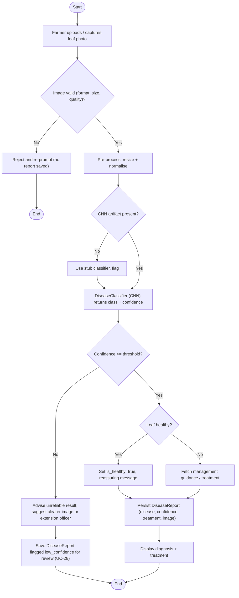
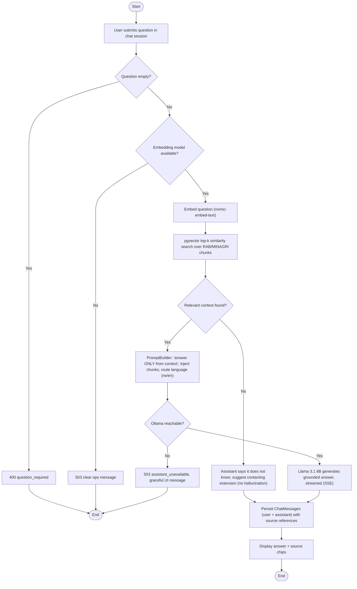

# SmartMurima — Activity Diagrams

Control-flow for the four key workflows, with the decision and exception branches specified in
`../USE_CASES.md` (stale data, low confidence, no-context "don't know"). Modelled as Mermaid flowcharts
with decision nodes. GitHub and the Artifact viewer render Mermaid natively.

## (a) Registration + OTP verification (UC-01, UC-02)

## (b) Irrigation recommendation (UC-14)

## (c) Crop-disease detection (UC-18)

## (d) RAG assistant query (UC-20)

</content>
