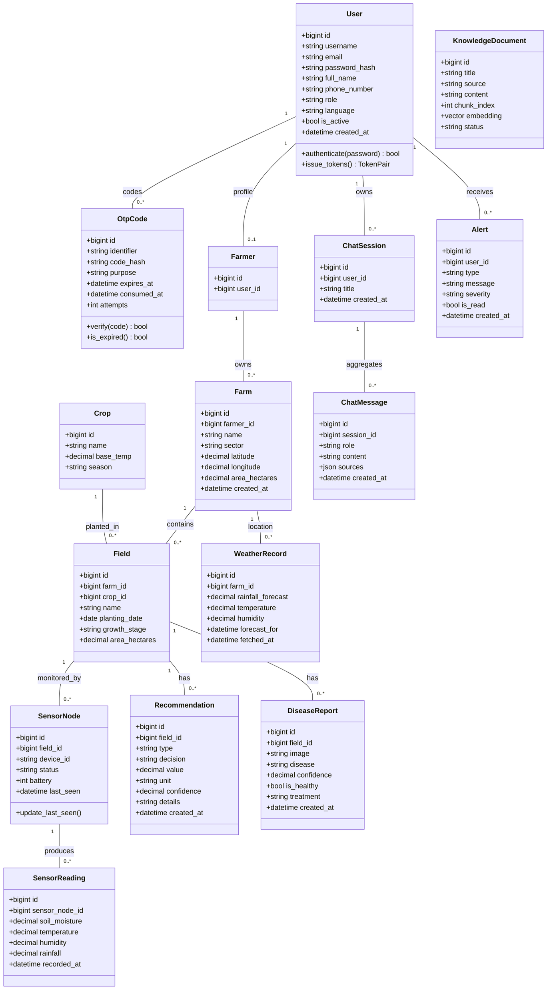
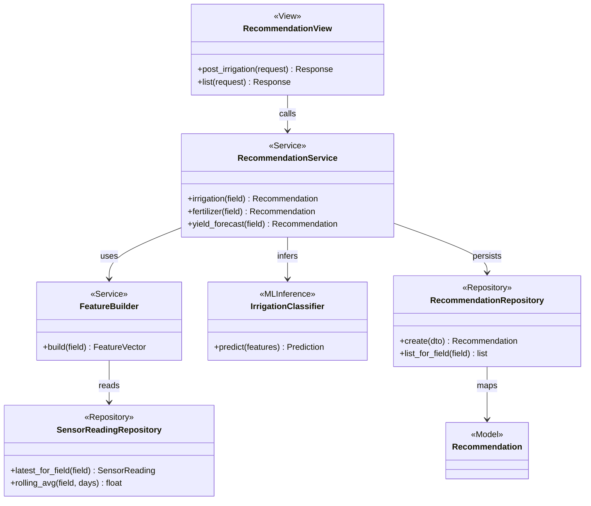

# SmartMurima — Class Diagram

Static domain model mirroring the dissertation class diagram (§4.5.3), the ERD (§4.5.9), and the
`BACKEND_PROMPT.md` data model. Attributes use the persisted field names; multiplicities match the
business rules in `../USE_CASES.md`. A second block shows the layered architecture stereotypes
(Repository / Service / View) conceptually. GitHub and the Artifact viewer render Mermaid natively.

## Domain model

## Layered architecture stereotypes (conceptual)

Every domain app follows the strict layering from `BACKEND_PROMPT.md`
(views → services → repositories → models). The example below shows the Recommendations app; the same
pattern applies to accounts, farms, sensors, diseases, assistant, alerts, reports, and weather.

</content>
