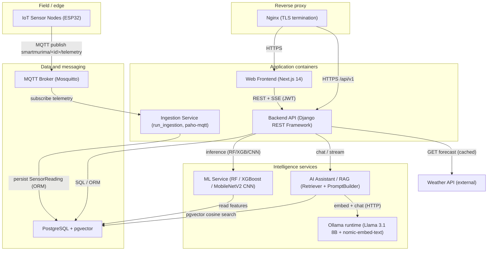

# SmartMurima — Component Diagram

Deployable software components and the interfaces through which they interact (dissertation §4.5.6),
consistent with `docker-compose.yml` and the layered architecture in `../SRS.md` §2.1. Arrows point in
the direction of dependency / data flow; edge labels name the interface or protocol. GitHub and the
Artifact viewer render Mermaid natively.

## Component responsibilities and interfaces

| Component | Container | Provides | Depends on |
|---|---|---|---|
| Web Frontend | `frontend` | UI (dashboards, chat, upload) | Backend API (REST + SSE) via Nginx |
| Nginx | (reverse proxy) | TLS termination, routing, static assets | Frontend, Backend |
| Backend API | `backend` | REST `/api/v1`, auth/RBAC, orchestration | DB, ML Service, AI Assistant, Weather API |
| Ingestion Service | `ingestion` | MQTT→DB telemetry persistence | MQTT Broker, DB |
| ML Service | (in backend / `ml/`) | irrigation/fertilizer/yield + CNN inference | DB (features), model artifacts |
| AI Assistant / RAG | (in backend / `rag/`) | grounded answers + sources | pgvector store, Ollama |
| Ollama | `ollama` | LLM chat + embeddings | model weights (llama3.1:8b, nomic-embed-text) |
| PostgreSQL + pgvector | `db` | relational + vector persistence | — |
| MQTT Broker | `mqtt` | telemetry pub/sub + buffering | — |
| Weather API | external | forecasts (optional, cached) | — |
</content>
