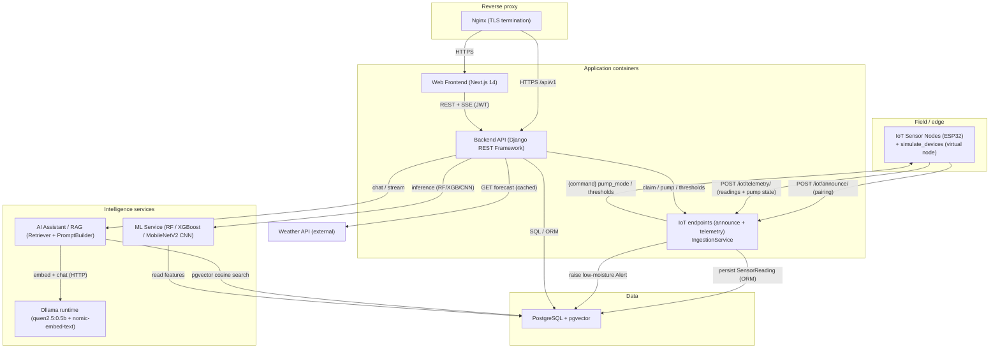

# SmartMurima — Component Diagram

Deployable software components and the interfaces through which they interact (dissertation §4.5.6),
consistent with `docker-compose.yml` and the layered architecture in `../SRS.md` §2.1. Arrows point in
the direction of dependency / data flow; edge labels name the interface or protocol. GitHub and the
Artifact viewer render Mermaid natively.

> **Telemetry transport:** field nodes speak **plain HTTP JSON** directly to the
> backend's `/api/v1/iot/` endpoints. There is no message broker and no separate
> ingestion worker: an ESP32 already has an HTTP client, and dropping the broker
> removes a service to run, secure and reason about. The trade-off is that
> buffering now lives on the device (it retries) rather than in a broker.

```mermaid
flowchart TB
    subgraph FIELD["Field / edge"]
        ESP["IoT Sensor Nodes (ESP32)<br/>+ simulate_devices (virtual node)"]
    end

    subgraph EDGE["Reverse proxy"]
        NGINX["Nginx (TLS termination)"]
    end

    subgraph APP["Application containers"]
        FE["Web Frontend (Next.js 14)"]
        BE["Backend API (Django REST Framework)"]
        IOT["IoT endpoints (announce + telemetry)<br/>IngestionService"]
    end

    subgraph INTEL["Intelligence services"]
        ML["ML Service (RF / XGBoost / MobileNetV2 CNN)"]
        RAGSVC["AI Assistant / RAG (Retriever + PromptBuilder)"]
        OLLAMA["Ollama runtime (qwen2.5:0.5b + nomic-embed-text)"]
    end

    subgraph DATA["Data"]
        DB["PostgreSQL + pgvector"]
    end

    WAPI["Weather API (external)"]

    ESP -->|"POST /iot/announce/ (pairing)"| IOT
    ESP -->|"POST /iot/telemetry/ (readings + pump state)"| IOT
    IOT -->|"{command} pump_mode / thresholds"| ESP
    IOT -->|"persist SensorReading (ORM)"| DB
    IOT -->|"raise low-moisture Alert"| DB

    NGINX -->|"HTTPS"| FE
    NGINX -->|"HTTPS /api/v1"| BE
    FE -->|"REST + SSE (JWT)"| BE
    BE -->|"claim / pump / thresholds"| IOT

    BE -->|"SQL / ORM"| DB
    BE -->|"inference (RF/XGB/CNN)"| ML
    BE -->|"chat / stream"| RAGSVC
    BE -->|"GET forecast (cached)"| WAPI

    RAGSVC -->|"pgvector cosine search"| DB
    RAGSVC -->|"embed + chat (HTTP)"| OLLAMA
    ML -->|"read features"| DB
```

## Component responsibilities and interfaces

| Component | Container | Provides | Depends on |
|---|---|---|---|
| Web Frontend | `frontend` | UI (dashboards, devices, chat, upload) | Backend API (REST + SSE) via Nginx |
| Nginx | (reverse proxy) | TLS termination, routing, static assets | Frontend, Backend |
| Backend API | `backend` | REST `/api/v1`, auth/RBAC, orchestration | DB, ML Service, AI Assistant, Weather API |
| IoT endpoints | (in `backend` / `apps/sensors/iot_views.py`) | device pairing, telemetry ingest, pump command | DB |
| ML Service | (in backend / `ml/`) | irrigation/fertilizer/yield + CNN inference | DB (features), model artifacts |
| AI Assistant / RAG | (in backend / `rag/`) | grounded answers + sources | pgvector store, Ollama |
| Ollama | `ollama` | LLM chat + embeddings | model weights (qwen2.5:0.5b, nomic-embed-text) |
| PostgreSQL + pgvector | `db` | relational + vector persistence | — |
| Simulator | `simulator` (profile `iot`) | a virtual field node for demos | Backend IoT endpoints |
| Weather API | external | forecasts (optional, cached) | — |

## Why the device is authenticated, not the user

A field node has no user session. It authenticates with a per-device token that
the backend mints when a farmer **claims** it, and which the board collects on
its next announce. That keeps an unpaired board — anyone's board — from writing
into a farmer's field, without ever putting a shared secret in the firmware
image. See `../IOT_INTEGRATION.md` §2.
