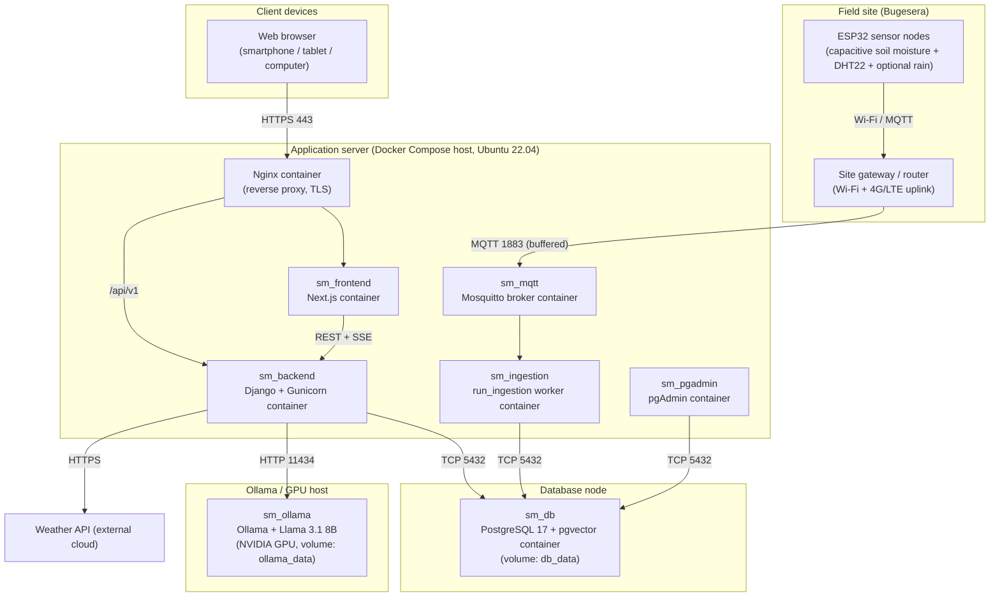

# SmartMurima — Deployment Diagram

Physical arrangement of software artefacts across hardware nodes and the communication paths between
them (dissertation §4.5.11), mapped to the containers in `docker-compose.yml`. Each application unit is
containerised with Docker and orchestrated with Docker Compose; the containers may be co-located on a
single well-provisioned server for the pilot or distributed as demand grows. GitHub and the Artifact
viewer render Mermaid natively.

## Container → port mapping (per docker-compose.yml)

| Container | Image / role | Host port |
|---|---|---|
| `sm_db` | pgvector/pgvector:pg17 | 5432 |
| `sm_pgadmin` | dpage/pgadmin4 | 5050 |
| `sm_ollama` | ollama/ollama (GPU optional) | 11434 |
| `sm_mqtt` | eclipse-mosquitto:2 | 1883, 9001 |
| `sm_backend` | Django + Gunicorn (3 workers) | 8000 |
| `sm_ingestion` | same image, `run_ingestion` entrypoint | — (worker) |
| `sm_frontend` | Next.js 14 | 3000 |

Persistent volumes: `db_data`, `pgadmin_data`, `ollama_data`, `mqtt_data`, `media_data`.
</content>
