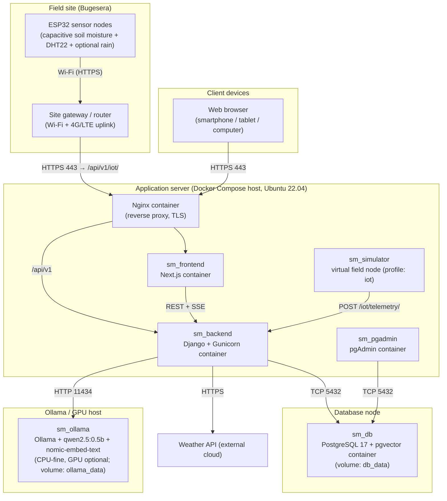

# SmartMurima — Deployment Diagram

Physical arrangement of software artefacts across hardware nodes and the communication paths between
them (dissertation §4.5.11), mapped to the containers in `docker-compose.yml`. Each application unit is
containerised with Docker and orchestrated with Docker Compose; the containers may be co-located on a
single well-provisioned server for the pilot or distributed as demand grows. GitHub and the Artifact
viewer render Mermaid natively.

```mermaid
flowchart TB
    subgraph FIELD["Field site (Bugesera)"]
        direction TB
        NODES["ESP32 sensor nodes<br/>(capacitive soil moisture + DHT22 + optional rain)"]
        GW["Site gateway / router<br/>(Wi-Fi + 4G/LTE uplink)"]
        NODES -->|"Wi-Fi (HTTPS)"| GW
    end

    subgraph CLIENT["Client devices"]
        BROWSER["Web browser<br/>(smartphone / tablet / computer)"]
    end

    subgraph SERVER["Application server (Docker Compose host, Ubuntu 22.04)"]
        direction TB
        NGINX["Nginx container<br/>(reverse proxy, TLS)"]
        FE["sm_frontend<br/>Next.js container"]
        BE["sm_backend<br/>Django + Gunicorn container"]
        SIM["sm_simulator<br/>virtual field node (profile: iot)"]
        PGADMIN["sm_pgadmin<br/>pgAdmin container"]
    end

    subgraph DBNODE["Database node"]
        DB["sm_db<br/>PostgreSQL 17 + pgvector container<br/>(volume: db_data)"]
    end

    subgraph GPUHOST["Ollama / GPU host"]
        OLLAMA["sm_ollama<br/>Ollama + qwen2.5:0.5b + nomic-embed-text<br/>(CPU-fine, GPU optional; volume: ollama_data)"]
    end

    WAPI["Weather API (external cloud)"]

    GW -->|"HTTPS 443 → /api/v1/iot/"| NGINX
    BROWSER -->|"HTTPS 443"| NGINX
    NGINX --> FE
    NGINX -->|"/api/v1"| BE
    FE -->|"REST + SSE"| BE
    SIM -->|"POST /iot/telemetry/"| BE
    BE -->|"TCP 5432"| DB
    PGADMIN -->|"TCP 5432"| DB
    BE -->|"HTTP 11434"| OLLAMA
    BE -->|"HTTPS"| WAPI
```

## Container → port mapping (per docker-compose.yml)

| Container | Image / role | Host port |
|---|---|---|
| `sm_db` | pgvector/pgvector:pg17 | 5432 |
| `sm_pgadmin` | dpage/pgadmin4 | 5050 |
| `sm_ollama` | ollama/ollama (GPU optional) | 11434 |
| `sm_ollama_init` | one-shot model pull, then exits 0 | — |
| `sm_backend` | Django + Gunicorn (3 workers) | 8000 |
| `sm_simulator` | same image, `simulate_devices` entrypoint (profile `iot`) | — |
| `sm_frontend` | Next.js 14 | 3000 |

Persistent volumes: `db_data`, `pgadmin_data`, `ollama_data`, `media_data`.

## Note on the removed broker

Earlier revisions placed a Mosquitto broker (`sm_mqtt`) and a `run_ingestion`
worker between the nodes and the database. Both were removed: devices now POST
straight to `/api/v1/iot/telemetry/` over the same HTTPS path the browser uses.

That deletes two containers, one port (1883) and one protocol from the
deployment surface. What it gives up is **broker-side buffering** while the
backend is down — that responsibility moves onto the device, which retries on
its next interval. For a 5-second telemetry cadence on a farm-scale
installation, losing a few readings during a restart is an acceptable trade for
the simpler, easier-to-secure deployment.
</content>
