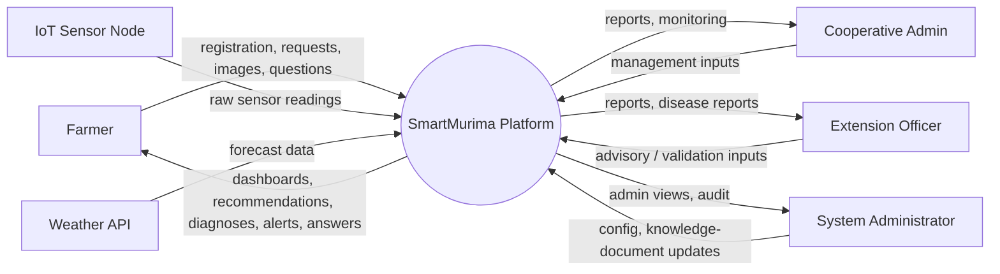
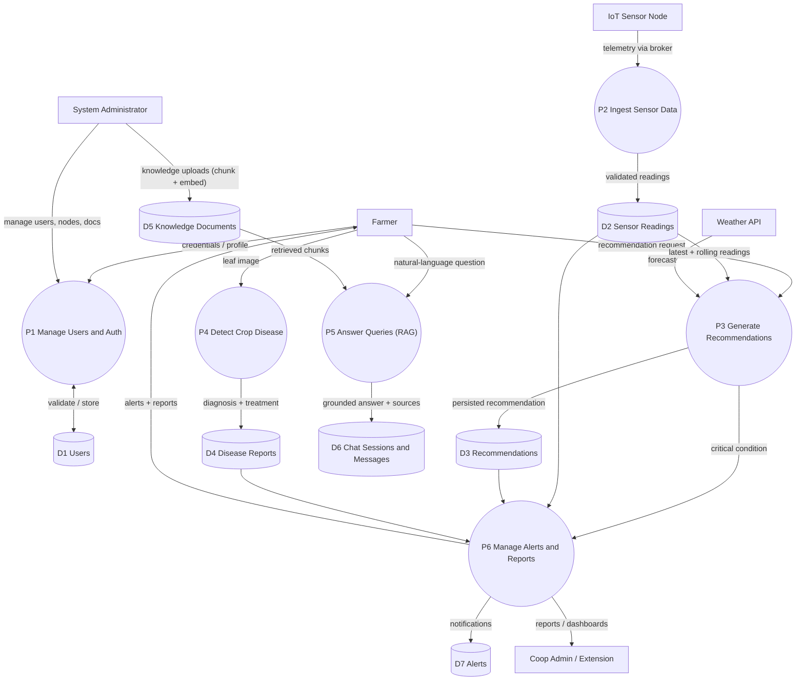

# SmartMurima — Data Flow Diagrams

Data-flow view per the dissertation §4.5.7. Notation mapped to Mermaid flowchart shapes: **external
entities** as rectangles `[...]`, **processes** as rounded boxes `(...)`, **data stores** as cylinders
`[(...)]`, and **data flows** as directed arrows. GitHub and the Artifact viewer render Mermaid
natively.

## Level 0 — Context Diagram (Figure 10)

The whole platform is a single process exchanging data with its external entities.

## Level 1 — Process Decomposition (Figure 11)

</content>
