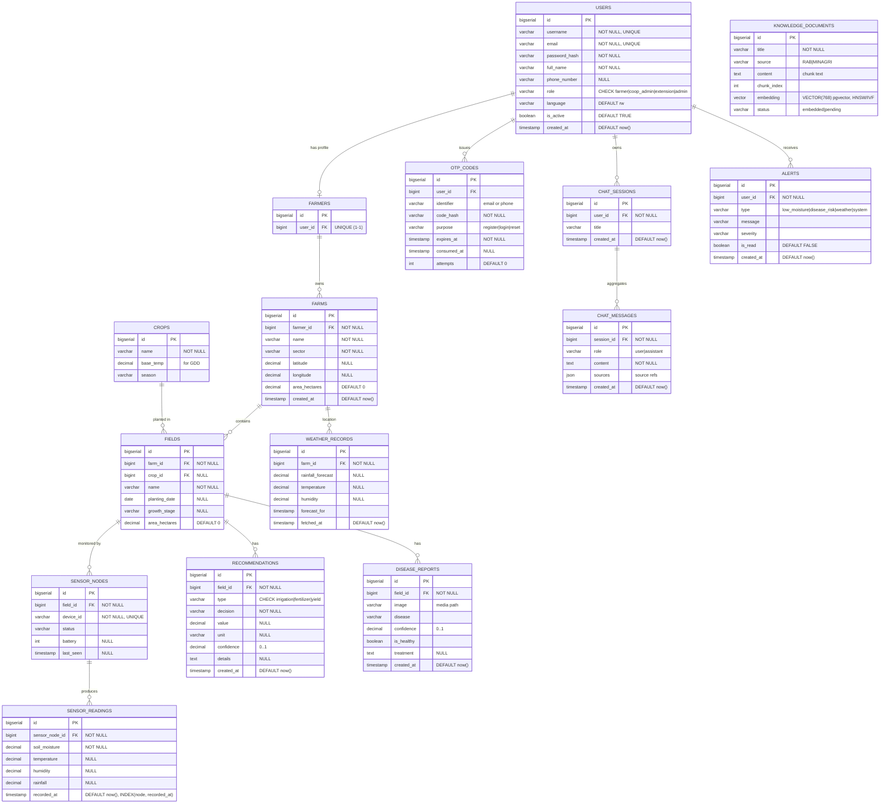

# SmartMurima — Entity Relationship Diagram

Normalised (3NF) data model with BIGSERIAL surrogate primary keys, matching the dissertation ERD
(§4.5.9) and data dictionary (§4.5.10) and the `BACKEND_PROMPT.md` model. Physical table names are
used. The RAG corpus table `knowledge_documents` carries a pgvector `embedding VECTOR(768)`. GitHub and
the Artifact viewer render Mermaid natively.

**Notes**
- `KNOWLEDGE_DOCUMENTS` is the RAG corpus and has no foreign-key relationship to farmer data (privacy,
  BR-AS2); it is retrieved by vector similarity, not by join.
- `SENSOR_READINGS` are immutable and deduplicated on `(device_id, timestamp)` at ingestion; indexed on
  `(sensor_node_id, recorded_at)` for dashboard/aggregation performance.
- Every AI output row (`RECOMMENDATIONS`, `DISEASE_REPORTS`) carries a `confidence` and provenance
  (`details` / `treatment`).
</content>
