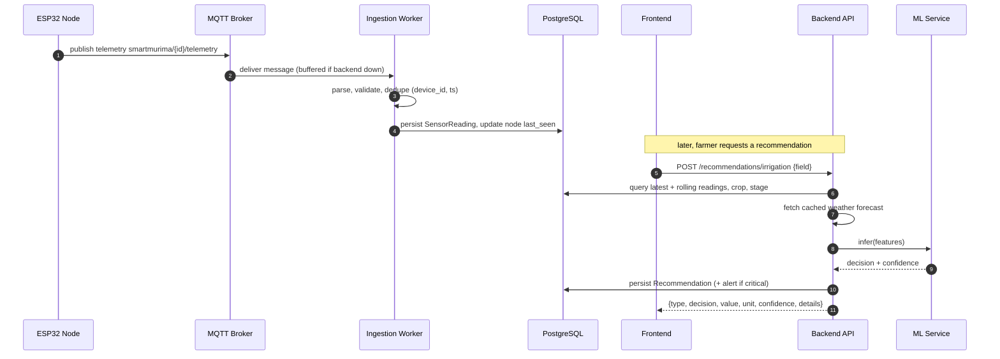
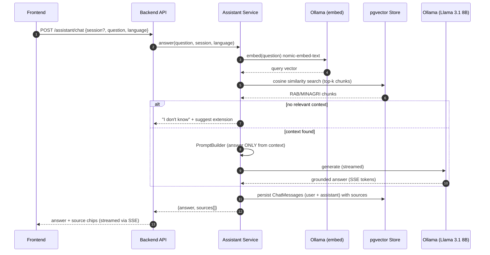
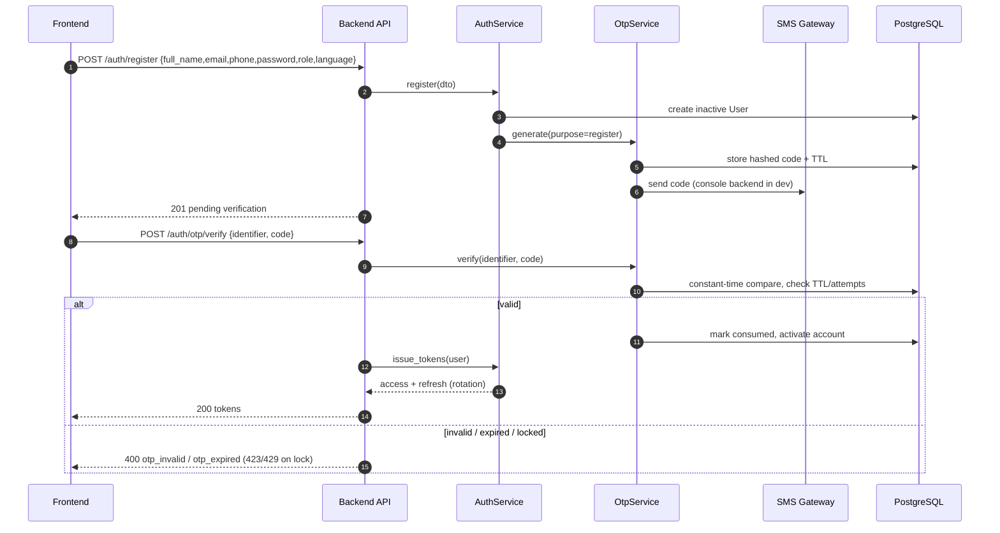
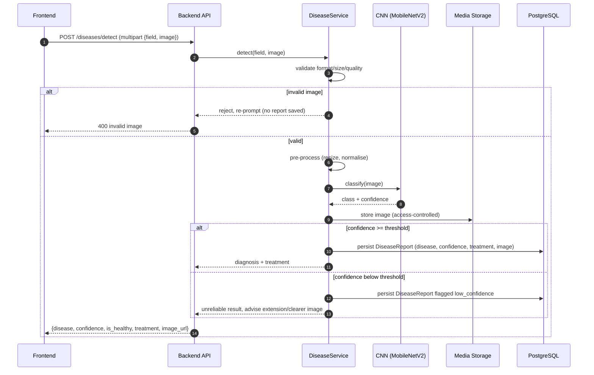

# SmartMurima — Sequence Diagrams

Time-ordered interactions for four representative scenarios (dissertation §4.5.5 plus auth and disease
flows). GitHub and the Artifact viewer render Mermaid natively.

## (a) Sensor data to stored recommendation (UC-11 + UC-14)

## (b) Farmer RAG query (UC-20)

## (c) Registration / OTP / login token issuance (UC-01, UC-02, UC-03)

## (d) Disease image upload to report (UC-18)

</content>
