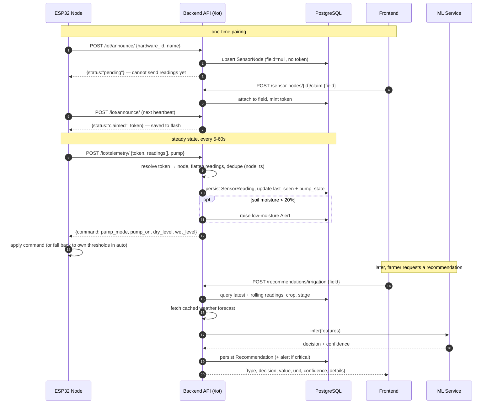
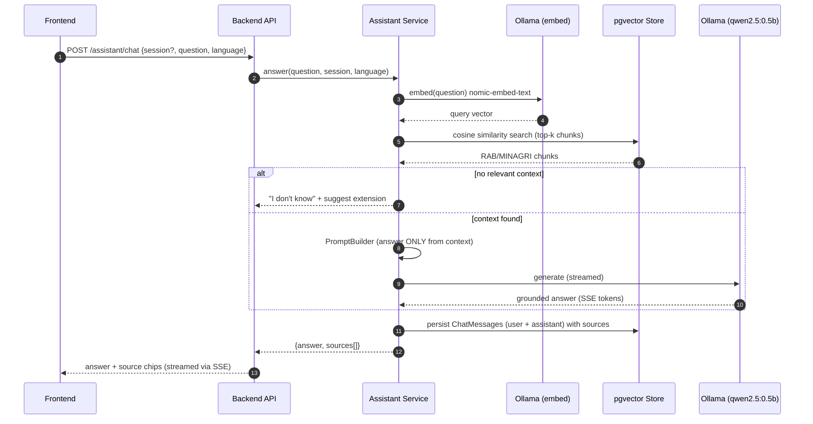
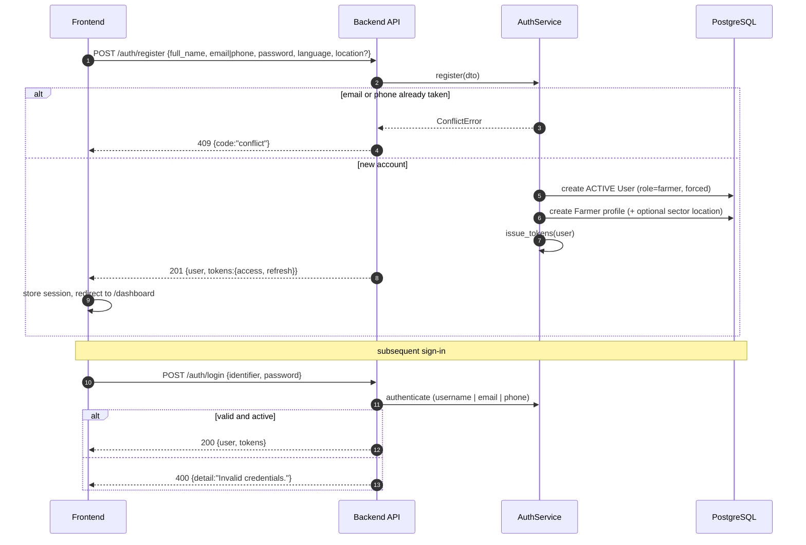
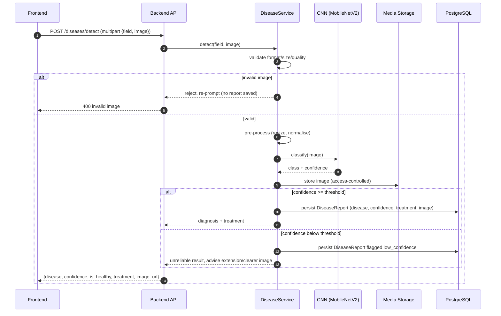

# SmartMurima — Sequence Diagrams

Time-ordered interactions for the representative scenarios (dissertation §4.5.5 plus auth and disease
flows). GitHub and the Artifact viewer render Mermaid natively.

## (a) Sensor data to stored recommendation (UC-11 + UC-14)

A device is paired first (announce → claim → token), then streams readings. The
telemetry response is not just an acknowledgement: it carries the pump command
back, which is how control reaches a node that has no public address.

```mermaid
sequenceDiagram
    autonumber
    participant ESP as ESP32 Node
    participant BE as Backend API (/iot)
    participant DB as PostgreSQL
    participant FE as Frontend
    participant ML as ML Service

    Note over ESP,FE: one-time pairing
    ESP->>BE: POST /iot/announce/ {hardware_id, name}
    BE->>DB: upsert SensorNode (field=null, no token)
    BE-->>ESP: {status:"pending"} — cannot send readings yet
    FE->>BE: POST /sensor-nodes/{id}/claim {field}
    BE->>DB: attach to field, mint token
    ESP->>BE: POST /iot/announce/ (next heartbeat)
    BE-->>ESP: {status:"claimed", token} — saved to flash

    Note over ESP,DB: steady state, every 5-60s
    ESP->>BE: POST /iot/telemetry/ {token, readings[], pump}
    BE->>BE: resolve token → node, flatten readings, dedupe (node, ts)
    BE->>DB: persist SensorReading, update last_seen + pump_state
    opt soil moisture < 20%
        BE->>DB: raise low-moisture Alert
    end
    BE-->>ESP: {command: pump_mode, pump_on, dry_level, wet_level}
    ESP->>ESP: apply command (or fall back to own thresholds in auto)

    Note over FE,ML: later, farmer requests a recommendation
    FE->>BE: POST /recommendations/irrigation {field}
    BE->>DB: query latest + rolling readings, crop, stage
    BE->>BE: fetch cached weather forecast
    BE->>ML: infer(features)
    ML-->>BE: decision + confidence
    BE->>DB: persist Recommendation (+ alert if critical)
    BE-->>FE: {type, decision, value, unit, confidence, details}
```

## (b) Farmer RAG query (UC-20)

```mermaid
sequenceDiagram
    autonumber
    participant FE as Frontend
    participant BE as Backend API
    participant AS as Assistant Service
    participant EMB as Ollama (embed)
    participant DB as pgvector Store
    participant LLM as Ollama (qwen2.5:0.5b)

    FE->>BE: POST /assistant/chat {session?, question, language}
    BE->>AS: answer(question, session, language)
    AS->>EMB: embed(question) nomic-embed-text
    EMB-->>AS: query vector
    AS->>DB: cosine similarity search (top-k chunks)
    DB-->>AS: RAB/MINAGRI chunks
    alt no relevant context
        AS-->>BE: "I don't know" + suggest extension
    else context found
        AS->>AS: PromptBuilder (answer ONLY from context)
        AS->>LLM: generate (streamed)
        LLM-->>AS: grounded answer (SSE tokens)
    end
    AS->>DB: persist ChatMessages (user + assistant) with sources
    AS-->>BE: {answer, sources[]}
    BE-->>FE: answer + source chips (streamed via SSE)
```

## (c) Registration and login token issuance (UC-01, UC-03)

Sign-up is a single round trip. The account is active on creation and the
response already carries the JWT pair, so the client goes straight to the
dashboard — there is no verification screen to fail at.

```mermaid
sequenceDiagram
    autonumber
    participant FE as Frontend
    participant BE as Backend API
    participant AUTH as AuthService
    participant DB as PostgreSQL

    FE->>BE: POST /auth/register {full_name, email|phone, password, language, location?}
    BE->>AUTH: register(dto)
    alt email or phone already taken
        AUTH-->>BE: ConflictError
        BE-->>FE: 409 {code:"conflict"}
    else new account
        AUTH->>DB: create ACTIVE User (role=farmer, forced)
        AUTH->>DB: create Farmer profile (+ optional sector location)
        AUTH->>AUTH: issue_tokens(user)
        BE-->>FE: 201 {user, tokens:{access, refresh}}
        FE->>FE: store session, redirect to /dashboard
    end

    Note over FE,DB: subsequent sign-in
    FE->>BE: POST /auth/login {identifier, password}
    BE->>AUTH: authenticate (username | email | phone)
    alt valid and active
        BE-->>FE: 200 {user, tokens}
    else
        BE-->>FE: 400 {detail:"Invalid credentials."}
    end
```

### Password reset (the one remaining one-time code)

```mermaid
sequenceDiagram
    autonumber
    participant FE as Frontend
    participant BE as Backend API
    participant OTP as OtpService
    participant SMS as SMS Gateway
    participant DB as PostgreSQL

    FE->>BE: POST /auth/password/reset/request {email|phone}
    BE->>OTP: issue(purpose=reset)
    OTP->>DB: store hashed code + TTL, invalidate open codes
    OTP->>SMS: send code (dev: printed to the backend log as dev_code)
    BE-->>FE: {identifier, expires_at, dev_code?}
    FE->>BE: POST /auth/password/reset/confirm {identifier, code, new_password}
    BE->>OTP: verify (constant-time compare, TTL + attempt limits)
    alt valid
        OTP->>DB: mark consumed; set new password
        BE-->>FE: 200 "Password updated."
    else invalid / expired / too many attempts
        BE-->>FE: 400 validation_error (429 when rate-limited)
    end
```

## (d) Disease image upload to report (UC-18)

```mermaid
sequenceDiagram
    autonumber
    participant FE as Frontend
    participant BE as Backend API
    participant DS as DiseaseService
    participant CNN as CNN (MobileNetV2)
    participant MED as Media Storage
    participant DB as PostgreSQL

    FE->>BE: POST /diseases/detect (multipart {field, image})
    BE->>DS: detect(field, image)
    DS->>DS: validate format/size/quality
    alt invalid image
        DS-->>BE: reject, re-prompt (no report saved)
        BE-->>FE: 400 invalid image
    else valid
        DS->>DS: pre-process (resize, normalise)
        DS->>CNN: classify(image)
        CNN-->>DS: class + confidence
        DS->>MED: store image (access-controlled)
        alt confidence >= threshold
            DS->>DB: persist DiseaseReport (disease, confidence, treatment, image)
            DS-->>BE: diagnosis + treatment
        else confidence below threshold
            DS->>DB: persist DiseaseReport flagged low_confidence
            DS-->>BE: unreliable result, advise extension/clearer image
        end
        BE-->>FE: {disease, confidence, is_healthy, treatment, image_url}
    end
```
</content>
