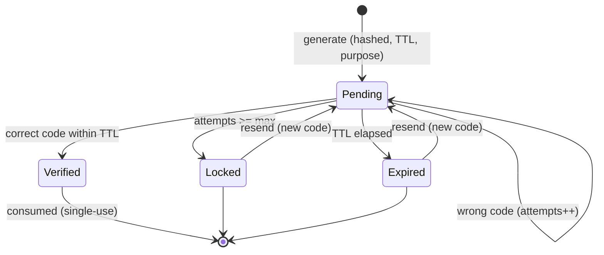
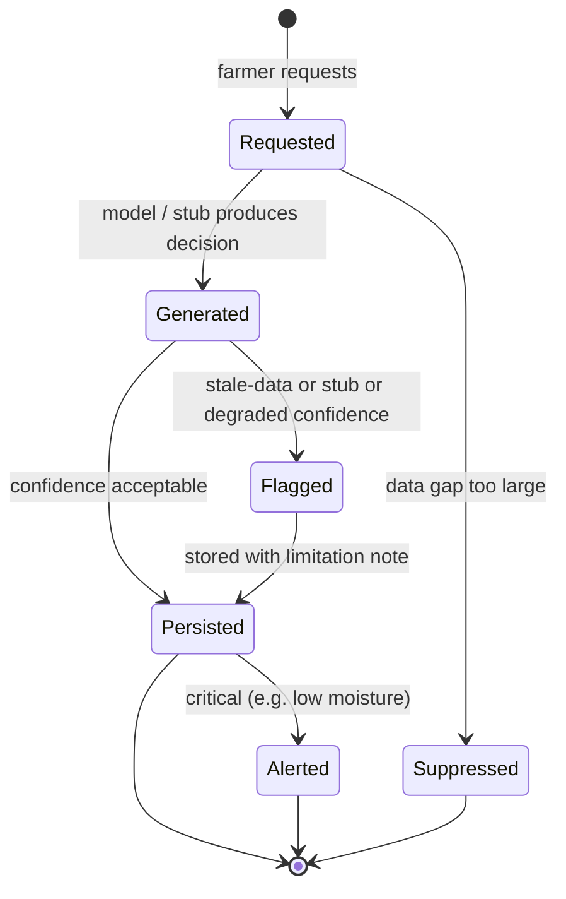
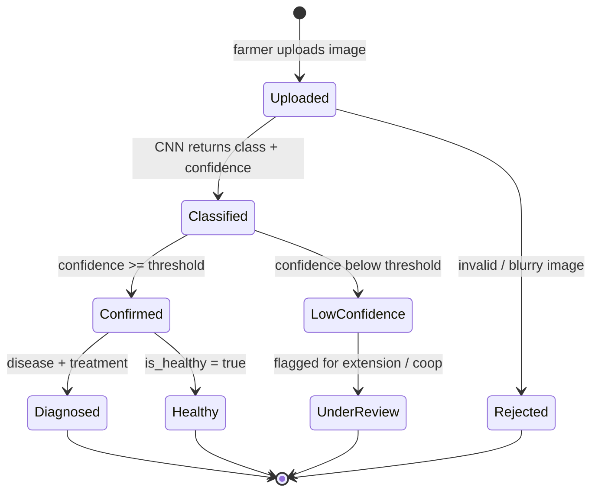

# SmartMurima — State Diagrams (bonus)

Lifecycle states for the OTP code and for the AI-output entities (Recommendation, DiseaseReport),
consistent with the business rules in `../USE_CASES.md`. GitHub and the Artifact viewer render Mermaid
natively.

## OtpCode lifecycle (UC-01, UC-02)

## Recommendation status (UC-14, UC-15, UC-16)

## DiseaseReport status (UC-18, UC-19, UC-28)

</content>
