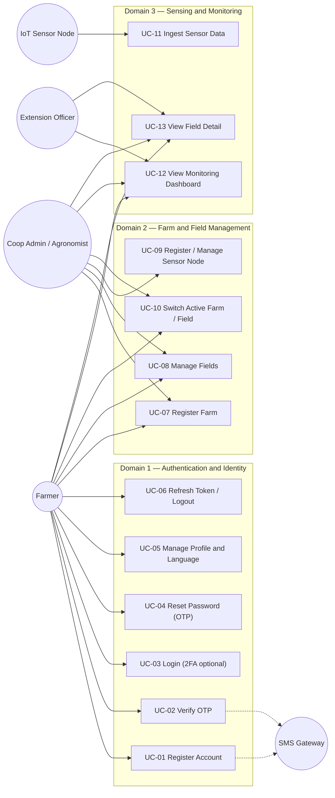
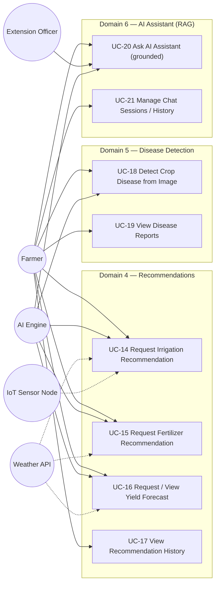
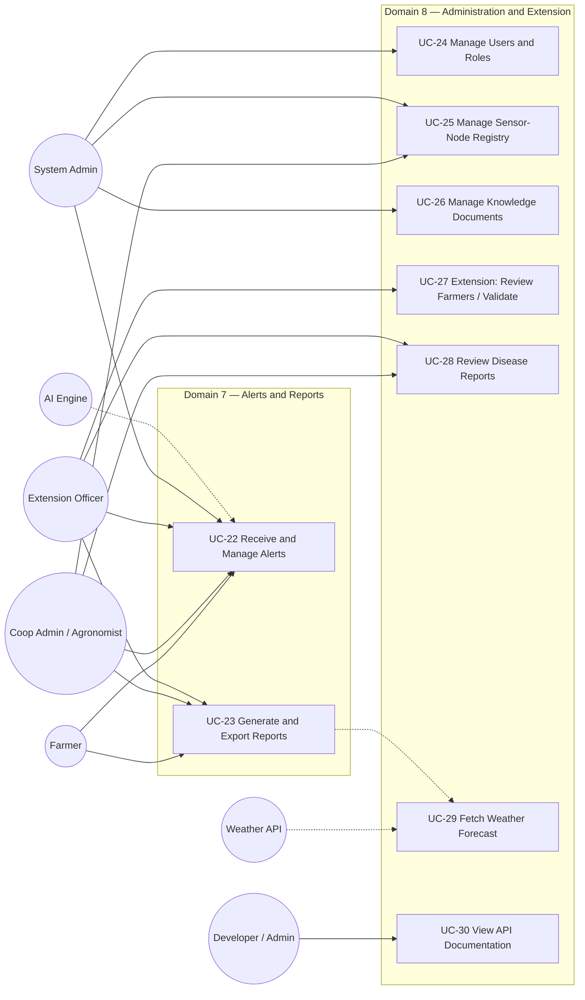

# SmartMurima — Use Case Diagram

All **30 use cases (UC-01…UC-30)** across the **8 domains**, with the four human actors and the three
system/external actors (IoT Sensor Node, AI Engine, Weather API; SMS Gateway supporting).
Cross-reference `../USE_CASES.md`. GitHub and the Artifact viewer render Mermaid natively.

Because a single diagram with 30 use cases is dense, the model is split into three readable views:
authentication + farm/field + sensing, then intelligence (recommendations, disease, assistant), then
alerts/reports + administration/extension. Actors are reused consistently across views.

## Actors

- **Farmer** (primary human) · **Coop Admin / Agronomist** · **Extension Officer** · **System Admin**
- **IoT Sensor Node** (system) · **AI Engine** (system) · **Weather API** (external) · **SMS Gateway** (external, supporting)

## View 1 — Identity, Farm/Field, Sensing (UC-01…UC-13)

## View 2 — Intelligence: Recommendations, Disease, Assistant (UC-14…UC-21)

## View 3 — Alerts/Reports, Administration and Extension (UC-22…UC-30)

</content>
